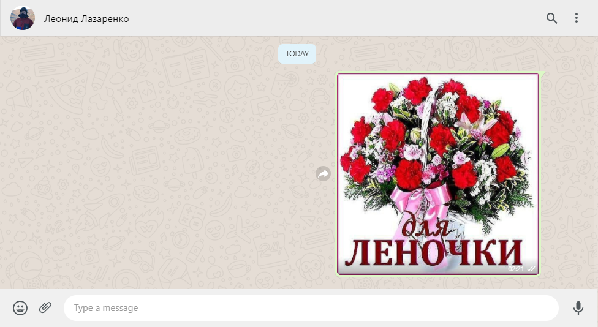

# Протокол HTTP. Основы работы с консолью разработчика в браузере


## Цель

Получить практические навыки работы с HTTP протоколом. На практике проанализировать процесс аутентификации пользователей в двух произвольных web-ресурсах.


## Постановка задачи:

Написать эссе, в котором анализируется процесс аутентификации пользователей в двух произвольных web-ресурсах.


## Эссе

**Начнем анализ с моей любимой социальной сети - [одноклассники](https://ok.ru/).**


Авторизовываться будем через аккаунт некоторой легендарной конторы.


Нажимая на авторизацию с помощью [mail.ru](https://mail.ru), мы посылаем POST-запрос на `https://o2.mail.ru/login` со следующими параметрами:

```yaml
o2csrf: ef07146868c540b5bdeec83aac8a6e24
Page: https://o2.mail.ru/xlogin?client_id=ok.ru&response_type=code&scope=&redirect_uri=https%3A%2F%2Fok.ru%2Fweb-api%2FmailAuth&state=test
FailPage: https://o2.mail.ru/xlogin?client_id=ok.ru&response_type=code&scope=&redirect_uri=https%3A%2F%2Fok.ru%2Fweb-api%2FmailAuth&state=test&fail=1
browser_data: {"screen":{"availWidth":"2560","availHeight":"1400","width":"2560","height":"1440","colorDepth":"24","pixelDepth":"24","availLeft":"0","availTop":"0"},"navigator":{"vendorSub":"","productSub":"20030107","vendor":"Google Inc.","maxTouchPoints":"0","doNotTrack":"inaccessible","hardwareConcurrency":"4","cookieEnabled":"true","appCodeName":"Mozilla","appName":"Netscape","appVersion":"5.0 (Windows NT 10.0; Win64; x64) AppleWebKit/537.36 (KHTML, like Gecko) Chrome/94.0.4606.61 Safari/537.36","platform":"Win32","product":"Gecko","userAgent":"Mozilla/5.0 (Windows NT 10.0; Win64; x64) AppleWebKit/537.36 (KHTML, like Gecko) Chrome/94.0.4606.61 Safari/537.36","language":"en-GB","onLine":"true","webdriver":"false","pdfViewerEnabled":"true","deviceMemory":"8"},"flash":{"version":"inaccessible"}}
mode: 
login: andrewshasucks@mail.ru
```

Из интересного здесь только `o2csrf` - токен безопасности, чтобы меня случайно не крекнули, и мой `login` от почты. Так как в почте я уже авторизирован, то мой браузер автоматически отправил мой логин.

Видим следующую замечательную страницу, но до сих пор не мой профиль в одноклассниках...


Соглашаемся продать имя и честь, а затем подтверждаем, что мы не дешевый скрипт на селениуме. Нажимая на кнопку `I'm not a robot`, мы отправляем POST-запрос на `https://www.google.com/recaptcha/api2/userverify` с непонятным бредом:

```yaml
v: tftmXwdbgCvrXiHxr5HGbIaL
c: 03AGdBq26I25ip0RM4e4JON-yqcCKUk0IaMt7Z5qOnKtIE7ENq86hxjy4T2oTAzUfq-vZpdQIRpD0t1MZ7_2NsaETfGcvfvSxID--CE1scCCjkxWsk8Rhewb6QCredyoNv0GGLYAQSEIKoRzjd887qESnHaLXDsNSblLeeKKZaHmoZwV_08MwfpI65aBct-HRiAd0JMT68By0T5qV-DnfE0OnYkNuOi9wFMt6w9i8eBKJQQ43Fj6kLpl0h2-9ju1cDjFc0Dbt0k1AWMKTM0mRNG09TUZsOaH9qyphw3X5gfhaOkgN-8LWRpXXmhKUQOUPfTQPNIM25iuM81jFqhptOSZ0X5yciTxI9nD2cB081t8KEgDe3tNEe9zxED_yQHBcMm6GWVu6xLdTI6RmnPJkjk4Q4p2KYtWh18NrnZPdO50gD8oa-lMwTT0xLSm2dR0eGakDiW5sZOamocf1Qoz5SrV4FP7SXkENXdQWlcAOMlQE5ZO42Djq2jBP1lJf5iE0mbfhtCmKn4-TEV2Wb6THnO2vPiumnCIM3y3LWN-u2AsplTauqICS0rFIRQPktFhmwc2VSp3dUdg3PB998YciRRZpdKQB1txTE8LJsX8ATtuVzZWqk_KnbQMss34BhwOAr5moQCaQp2imbUp7Y6ROVBo2x5FF4aqDAVJmPR57yERi5vOrx3AOQg3_O6Kbwy51OFmOrjFUuL7YdHKvWi64gHJsn66e70acbM-VmZ5pAAeLDgddFHV6PIQNzVxCAVXJdoNa3ZOi3bLLVZD-lRvAJ_iGj86T0RNRwRdQ3FUgvKOEEiH5bVs5Fu0KdUcHeb36foOHTPBIvnwkZW70y9OgCROQ2PyJMRjoICNxv8yEgMEQH6n_CFo7uvzWio8MjjDOOhAfEFXgYPxWaCIkr2T89X4Xt7dUXtb9msaspnIXu34y3gZNHpBO2GqYYOgDrzd6LTplDLVTohKhDtNO2kL8pJW0TXy3_wFOLenZ59cNWPSH_TDTMb3KhuFG92K1X9sUj45ArafXoytBhshMROLcy-al4--2X6o3vYFLxcigst7K63GDG5iP_IPYdA-Oz9xAFf_hQFE0XXrefHdCCEWEsLCNKY5pwJ8LWxKf5pYM9Naa9aL-xZRn5_Q99YFgWKfAQ3kilHMza4Xsv_cVNJAB_-pow9ayJSzvEZ2DKW9PTJO9F7VeRkQ64GTEbEcyTEKYEOaEYl6DKELpDXPKugaaAhPl6iGJYWJOLx9Rdx7JJ3xTkKV0ycGukpK9N52uqkBFbQJlq_OTB2-fnlOeijZu53REDqPQ6pqH7FyV9Q9hxCZlnmTOxnmc-433zJwlZlKLtJbfsKwLooJcnaty6FFkP_8XaAOxpZaKtuhkmhgTktOKpIht7wKtbhX_PyDRz1ANT5rsUcnFwe6b-wlOo-dYvff7RwT-rbWlra3hbeAa4ZbUmd6lAF_tSZ3Jk0Q3A28vHlpbsZ1pndBbspJDLfaV93SpmvUMrkWdn1nfmXwf-dPb4J3FBQcVA4m4xof98wvGM1OPyxdEZ_W3GwRFARg7IwDIdXRJ9KzKKGOxBWAaf0iRROmI3kXhqH394o-wgutXg58kMsMHBFds70K4jbvG1rJNFeSJo39pMMxCqSjWxf-seAlttR4oX2TG88mLcZsHf-j45WRLNfQZjr3RjZaVGGp3_xjddWK944h54-d2RpNkZb3xEyiYxnEsK9glzW0j25AvsZkLBjmRnvMOk3qwAzDkERjBWTj5KbEXX2l3uw3Mj8nmSNih8cM4TAON7ToB2f2VDmnntN-0ItHNsyVbTZZuUtamMv_GPFlYA4jp1Hsaz40lM-wuEHlw28w67yzYsqCSHGMuIEXtlXhAjmVd8zQp3O4Tggug_LvZx5FDHM5ZGy14HdQBKPqQM5sYSd3XcmATjm6VfL24xlHAmtvTX3u0yFaZ4tzklZNMQWhxBibZap6mVPOBrXX9CBLbGEQQyP9CmF1-QJ8vtWr9xt3jGq0R4EbbZIZtTjDVCAXM3Yk3KJNZIN6LcaeKSYbNQ1sbwU2YyF-DKcLYGu2ltkBf-zlJKcqDysBcnraTh_6xHToQIaZCOVEQQ9N_Cwao5Z66eh7hgQtcb6kUMr-52Zw7PNd3MywI-WCKuIPe0QfSJzS37eru5TzXENlGIqUKda3BPn_rU2OcUz_tHpWotUL0lKu2iKQmm9TUcYl1NyaWsbD72WJN4yy7IsII44lJMLTLk8CZxRqDt-HEtQDvGKBDOAfvTqLTusywkSUaKnOajS1WeNd2QO9L1dUMD60u_kiM_dfvINCnak9zShnohr4yjYv2m4fFup6pt78fL8SOCkjjhMIRcUfTUSq1jdt773kuLL4tZ0OtvEwKz3W5Xvn3f1UmAigzVwQTqTn_CGKzwHC-uXGPqksqT_rFFsIkYQfgRr7Ldg9Sv7627c55wYuG5T7XQavQ9ohpUVhFSqoZdAhmahntl4Pua_oE793O7sgk3SvzT7uOoi3X70w28bcWlqwG-_hhqiaYq-CQ0QycQFsalZnLPSOAfGf5j35NAnMOb7gCjJj_9YN4-JFoyLYtMy9i48LhrGGO78g
response: eyJyZXNwb25zZSI6IiIsInMiOiJhMzgxIiwiZSI6ImJXMXZDS2cifQ..
t: 234
ct: 234
bg: !vriguL0KAAQeC2jXbQEHDwM0rRMg98Tw1hSegXmdHib9WfkfJVYtPlI_mF7qtmev8cvHwQ_AEePlGI0Lhuy2FeyRMHa4CuwhjruW7wvtSbiJRqnzARxSURX-xmZS1X40JS2cD2kcfvwJG675PNkb0EcqzBfJwXjURY6oAbm5QBItESdvhSuOXd6Xw3rcGCyuDn_mFGUAq7UKqWC0p79o22yl4ogHKGzE0lJJLwqsucIWxb3yIWFUDy4wQUdcocua9YkoVK-EDRmzOnAXgNa--sVVNvHuHSojoLjagWm-AOM6CA4sqc0c2sXVcuTiL0V6gB5C9j9kWmGqwg8RCPrfJ3Vmwk4f7S5uh9v4B7Kxm9W4E52_yO_Qb5_NSQjiZ2YZXwK1cSd0qk1F2NHQbRrsd52RcKjLcnEFLJbzhoWNx0UCBo-6VI1T2D9HUtq-aKzLnEKtLceGOksj5juHy5vkTOX6y2SyDpWcTnqu2wVRBHuy3nv8aRPZx0tBEhK6W1vW-YvFFdY-SZBPCCYkaHVnN2XF8basHFuVwo6Br7l2_rNfMeejAaC088-cOKIOpfRQvl_BdwIwRlwcG0EXeCICFGd7XxJkxwEKbLQ2sCl1eGYUfi_Ug-ouQ4uSdneNbr4xgT6SehwcACJQVLPlYiTb-tDx3CC4EyPvc6b5xY9Q3dBoNSpabXwj0F3k-gHdSWedBvITUq9oXzCvLBsDSn1mIPqzv-3jRALfWSLInKKS4wrKKo1PFx21lh0gSSBS6tia8Dw1eIYDMKk5VfuDgbYcaqMhvmceBNwtT7KHnOLJXvT9HV6ta61D1AZPzo8uhMrvYFhdVoLaHKkGmR3nmIJl80j-ASTTjdLvBzg4TIinSI9p1AYdgywebK-chvwCXf7NpIMHMmpRn-iF1CqdLQBVUxOGKcjn5aS5EnFE7U0ny1uVhDQzxj6ynYDX937hgUQ5Z760Vg4cz8oX49745gBFmk1YHBWAb8MWznj9MPXn2Q6wq-nAsK3pfhzq-PrrmNADiIlRTt2nXzWFvMJEOevjB7tTjM8SpdGwo_kfO4FcKmZqpOQJgRMmhfCpzkdQAWNo7s7tJVnJ0Oo20aUQsojK-LNzTDlyNZwAefDtGguM41AZgbRaDKOPx5_X4-2RulGylGH7ffNoRKtVJM_Y_5zZ26X_2ysvdJXd_AgNrar-LszmIRbwIPTdhdXgvEArgcRmupKiPe1nvN6nhbfvyDyXRdhzJK3GhJ4kT0XNbASgob4eqZlUaiZ5L5Whp4Css3tlGJA
```

Ну да ладно, это не так важно пока, - главное, что мы прошли капчу. Жмем на `Allow`, и магическим образом оказываемся на странице моего профиля. Просто **_ИЗЯО_**, как говорил мой друг Изя.


Пришлось отправить ещё один POST-запросик, чтобы получить доступ, на этот раз сюда: `https://ok.ru/dk`.

```yaml
cmd: SocialSignIn
s.sign.error: 
s.sign.code: 7cf0ea568e337e7285addebcfae556db0666bc5637363830
id_token: 
user: 
s.sign.socialProvider: MAILRU
gwt.requested: 8baf30c3T1632310935418
```

Здесь мы указали, каким типом авторизации воспользовались, а также наши ключи, впоследствии чего мы создали сессию.

---

Я тут нашёл замечательную открытку для моей шкуры, и настало время наконец её отправить.


Отправлять я её буду через [веб-версию WhatsApp](https://web.whatsapp.com), для этого мне нужно там авторизоваться по QR-коду из мобильного приложения.


QR-код дается автоматически при загрузке страницы, но его срок действия может закончиться. QR-код обновляется автоматически примерно каждые 20 секунд по уже установленному веб-сокету, пока не закончится некоторое количество попыток. Когда попытки закончатся (ведь симпл-димпл круче), обновить код можно будет самостоятельно, нажав на соответствующую кнопку. Таким образом мы пошлём сообщение через веб-сокет и получим ответ. Вот небольшая история сообщений по веб-сокету:


Тело сообщения состоит из `UNIX Timestamp`, `номера сообщения` и `самих данных` (в основном так). Первое сообщение означает, что я решил обновить QR-код самостоятельно по истечению автоматических попыток, на что получил положительный ответ, где и переданы хеш нового QR-кода и его TTL - 20 секунд. Затем раз в некоторое время мой браузер отправляет сообщение для автоматического обновления QR-кода. `?,,` - это просто отправка пинга, подтверждающая, что я всё ещё слушаю входящие пакеты.

Теперь попробуем навестись фотопушкой от ~~МОАИС~~ СИАОМИ на QR-код, и посмотрим, что произойдет.


Сразу же посыпались сообщения по веб-сокету (это лишь часть). Каждое сообщение дало инструкции, какие запросы нужно сделать браузеру, чтобы загрузить недостающие файлы и корректно отобразить страницу. Таким образом мы и получили веб-отображение моего аккаунта WhatsApp.

А теперь наконец можно отправить найденную открытку.

